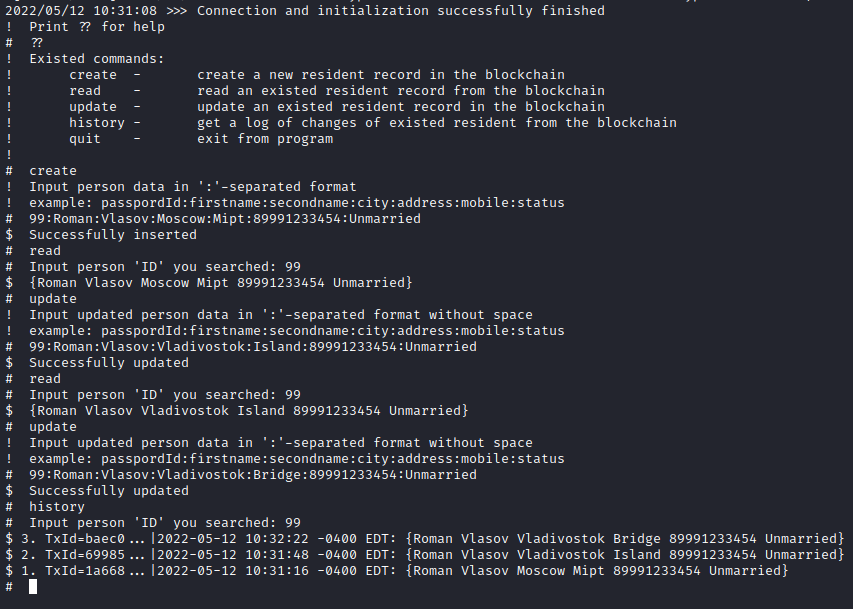

# Проект №1 по курсу Blockhain-конструктор HLF в МФТИ (9 семестр)

**Идея:** реализовать chaincode для HLF, позволяющий вести записи о населении, и пользовательский application для вызова соответствующего API chaincode

**Набор хранимых данных:** (структура [Resident](chaincode/go/residents.go))
- Номер паспорта: `pass` - `считаем первичным ключом, который идентифицирует человека` (по этому ключу будем класть данные в ledger HLF)
- Имя: `Firstname`
- Фамилия: `Secondname`
- Город: `City`
- Адрес проживания: `Address`
- Номер телефона: `Mobile`
- Семейный статус: `Status`

**Реализованный функционал в [chaincode](chaincode/go/residents.go)**
- Внесение записи о человеке - `InsertResident`
- Получение данных о человеке из ledger - `QueryResident`
- Изменение данных о человеке - `UpdateResident`
- Получение истории изменения о данном человеке - `ReadHistoryResident`

**Клиентское приложение [application](application/go/main.go)**
- Предоставляет доступ ко всем API, реализованным в смартконтракте
- Принимает два аргумента: `channelName` и `chaincodeName`
- Подробную инструкцию по user-interface можно получить, запустив приложение с подготовленной сетью и задеплоенным chaincode ([скрипт автоматизации](./build.sh))
- Скриншот возможного использования 

**Сборка тестовой сети**
- Установка необходимых пакетов (docker, docker-ce, composer, golang...)
- Внутри склонированной директории проекта вызов `./build.sh channelName chaincodeName`
- После этого тестовая сеть поднята и [chaincode](chaincode/go/residents.go) задеплоен в сеть HLF

**Запуск приложение и сборка мусора**
- [apprun.sh](./apprun.sh) - запуск клиенского приложение: `./apprun.sh channelName chaincodeName`
- [clear.sh](./clear.sh) - чистка репозитория от остатков сборки/компиляции
